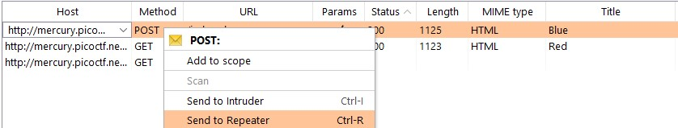
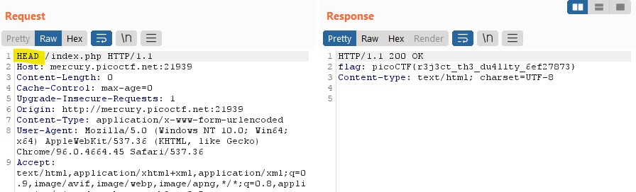

# Get aHEAD

**Description:** Find the flag being held on this server to get ahead of the competition

**Solution**

The first thing that comes to mind is that this has something to do with the header.
```
<div class="container">
			<div class="row">
				<div class="col-md-6">
					<div class="panel panel-primary" style="margin-top:50px">
						<div class="panel-heading">
							<h3 class="panel-title" style="color:red">Red</h3>
						</div>
						<div class="panel-body">
							<form action="index.php" method="GET">
								<input type="submit" value="Choose Red">
							</form>
						</div>
					</div>
				</div>
				<div class="col-md-6">
					<div class="panel panel-primary" style="margin-top:50px">
						<div class="panel-heading">
							<h3 class="panel-title" style="color:blue">Blue</h3>
						</div>
						<div class="panel-body">
							<form action="index.php" method="POST">
								<input type="submit" value="Choose Blue">
							</form>
						</div>
					</div>
				</div>
			</div>
		</div>
```

I can see on the client-side that this has two HTTP requests enabled. Running off the title what happens if I try to send a HEAD request?


I can achieve this by spinning this by proxying the site through BurpSuite and sending an captured HTTP command to Repeater.


On Repeater, I'm able to change the POST request to a HEAD request and send to find our flag.

**flag:**
picoCTF{r3j3ct_th3_du4l1ty_2e5ba39f}