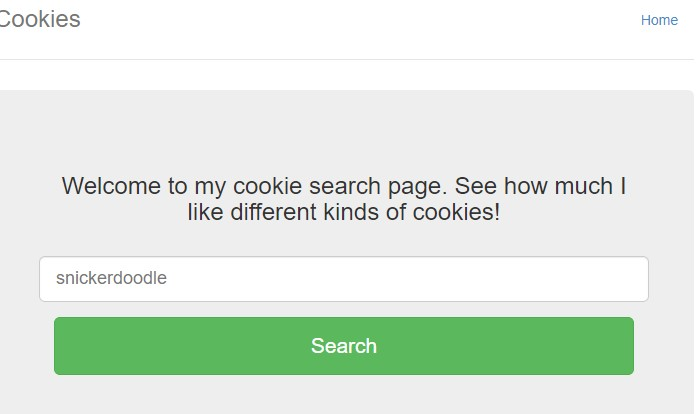
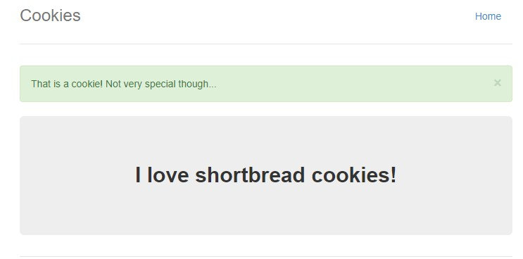

# Cookies

**Description** Who doesn't love cookies. Try to find the best one.

**Solution**

This begins with a simple web page with an input form, where there is a default value of 'snickerdoodle'.

With the title referencing 'cookie' cookie information is likely to be helpful as we navigate the site. This is under 'Storage' and 'Cookies'.

There is once cookie there with the name, 'name' and a value of -1.

Just as a test I alter the cookie value to 4 and refresh the browser to see what happens. 
This page pops up.

If i'm able to increment this value manually, what else is possible to discover.

This is kind of cumbersome and even upon finding the flag, it'd be helpful to find a way to automate this.

Running through different cookie types, and 18 the flag is revealed.

**Flag:** picoCTF{3v3ry1_l0v3s_c00k135_bb3b3535}