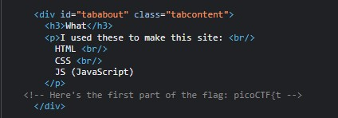

# Scavenger Hunt

**Description:** There is some interesting information hidden around this site. Can you find it?

This starts pretty straight forward. I open up the developer tools to poke through the JS, CSS and HTML. 

The first part of the flag is in the CSS and the second is in the CSS.

On the JS page I see that it's taking us to a myjs.js called in < script >.

There is a hint there:

`/* How can I keep Google from indexing my website? */`

I looked this up and it appears as if there are to two methods to block search indexing:
* using a `<meta> tag`
* using a HTTP response header

I input robots.txt in the end of the URL and I find this page:

Upon inspection in the Apache Server docs I see that one of the attributes of Apache server is a .htaccess file.

Checking with this file in the URL, I then get further information.

http://mercury.picoctf.net:44070/.htaccess

Getting this information I then check to see if a .DS_Store file has been uploaded, knowing that this a standard file placed in .gitignore in GitHub uploads.

http://mercury.picoctf.net:44070/.DS_Store

The closing curly bracket is shown completing the flag.

picoCTF{th4ts_4_l0t_0f_pl4c3s_2_lO0k_7a46d25d}